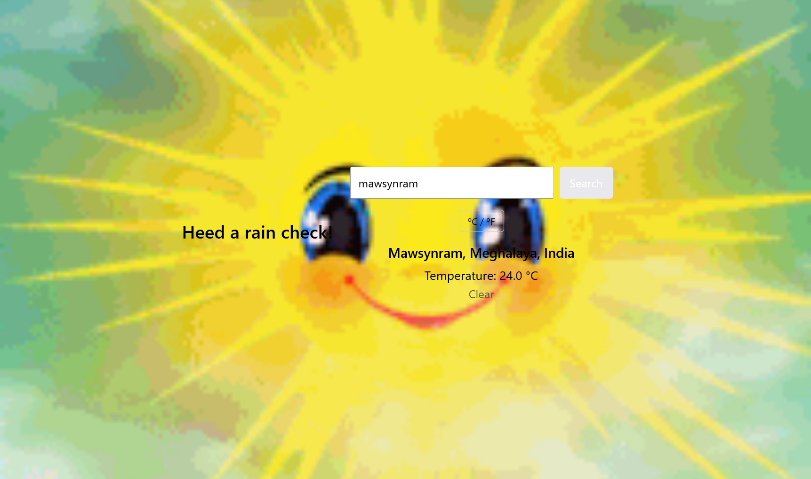

# Weather App

A simple weather application built as part of The Odin Project curriculum.

## Features
- Search weather by city name
- Displays temperature and current conditions
- Toggle between Celsius and Fahrenheit
- Displays a weather-related GIF using Giphy
- Graceful error handling

## Technologies Used
- HTML
- CSS
- JavaScript
- Visual Crossing Weather API
- Giphy API

## Notes
This project is frontend-only. API keys are exposed intentionally for learning purposes.
